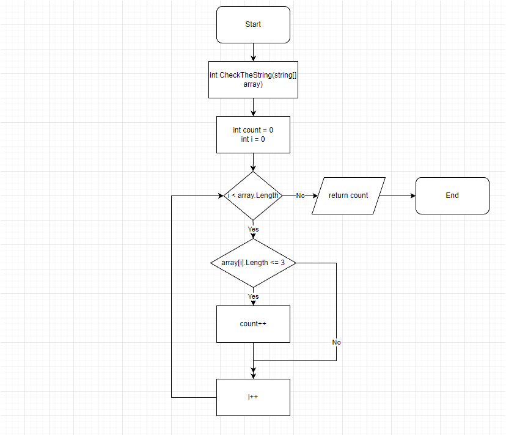
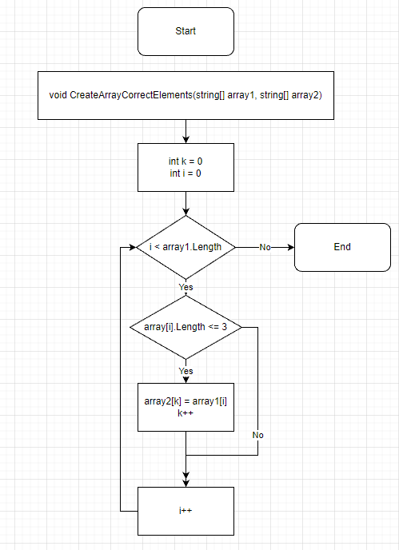
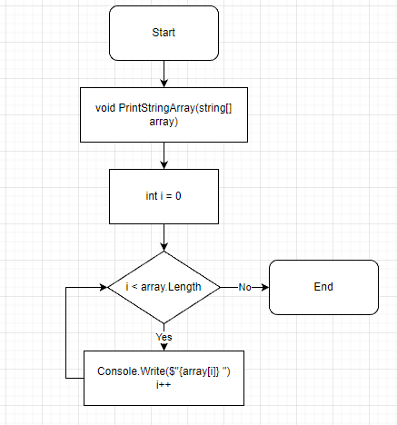
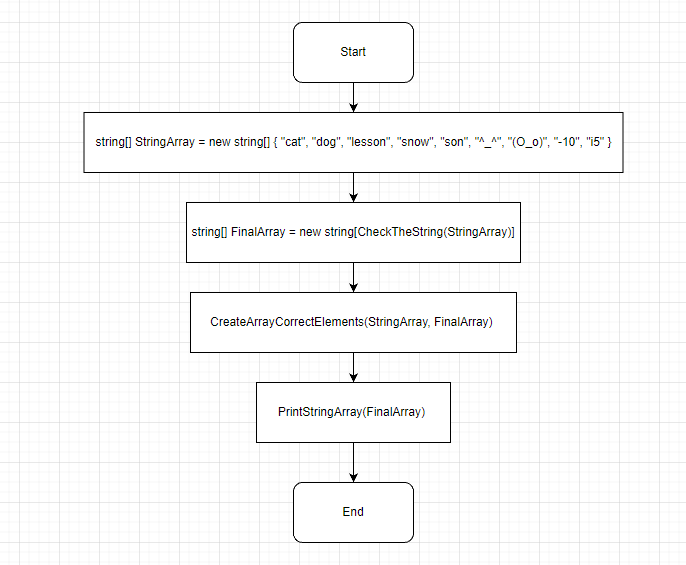

# **Итоговая проверочная работа.**

+ ## [*1 этап*](#1-этап)

+ ## [*2 этап*](#2-этап)

+ ## [*3 этап и блок схема метода*](#3-этап)

+ ## [*4 этап и блок схема метода*](#4-этап)

+ ## [*5 этап и блок схема метода*](#5-этап)

+ ## [*Финальная общая блок схема*](#d184d0b8d0bdd0b0d0bbd18cd0bdd0b0d18f-d0bed0b1d189d0b0d18f-d0b1d0bbd0bed0ba-d181d185d0b5d0bcd0b0-1)

---

# *1 Этап.*

Сначала я захардкодил массив из строк, в котром все элементы имели различное количество символов.

# *2 Этап.*

Для того, чтобы создать финальный массив с нужными нам элементами, мне необходимо было узнать, сколько элементов соответсвуют требованиям в задаче, чтобы не переполнять память, выделяя под финальный массив слишком много места. Для этого я сделал возвращаемый метод (*__CheckTheString__*),  в котором через _цикл for_ перебрал элементы массива строк и, получая длинну каждого элемента, проверял их на соответсвие через __условный оператор if__ к условиям задачи. При этом **ввел счетчик**, который, собственно, с каждой иттерацией увеличивался на 1. Таким образом, я узнал нужную длинну финального массива. 

# *3 этап.*

Я создал пустой массив, где подставил результат работы метода *__CheckTheString__* в длинну создаваемого массива. Таким образом, я получил пустой массив с нужной длинной.

# *4 этап.*

Основное решение задачи по заполнению финального массива я так же вывел в невозвращаемый метод *__CreateArrayCorrectElements__* . В нем я снова пробегался по элементам исходного массива через _цикл for_, выявляя через **условный оператор if**, но в этот раз, при выполнении условия оператора, я записывал найденный элемент исходного массива на *__k__* позицию финального массива. Чтобы каждый новый найденный элемент не перезаписывать на статичную позицию *__k__*, в начале метода я ввел эту переменную и присвоил ей значение 0. А при каждом успешном выполнении **условного оператора if**, я увеличивал ее значение на 1. Таким образом, после всех иттераций, я получил финальный заполненный массив с элементами, которые отвечали требованиям задачи. Осталось только вывести массив на экран и убедиться. 

# *5 этап.*
Даже не знаю, что тут описывать. Стандартный вывод массива на экран через _цикл for_. Использовал интерполяцию строк. Так же вынес это в отедльный метод *__PrintStringArray__*.

---

# *Финальная общая блок схема*

